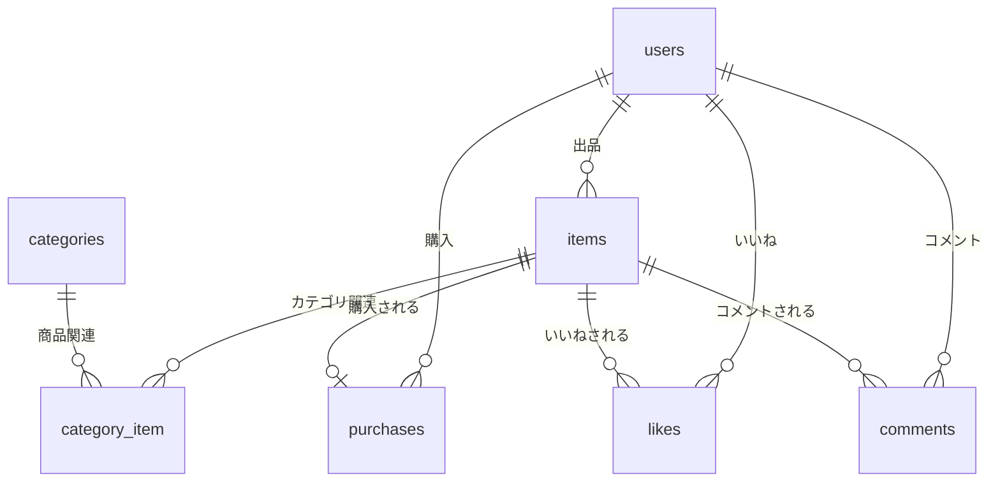

# COACHTECHフリマ

COACHTECHフリマは、ユーザー間で商品の売買ができるフリーマーケットアプリケーションです。


## 作成した目的

模擬案件を通じて、実務に近い開発経験を積むために作成しました。

## アプリケーションURL

- 開発環境: http://localhost
- phpMyAdmin: http://localhost:8080
- MailHog: http://localhost:8025

## 機能一覧

### 基本機能
- 会員登録
- ログイン/ログアウト
- メール認証（応用機能）
- 商品一覧表示
- 商品詳細表示
- 商品検索（キーワード検索）
- お気に入り機能
- コメント機能
- マイリスト表示
- マイページ表示（出品商品・購入商品）
- プロフィール編集
- 商品出品
- 商品購入
- 住所変更
- Stripe決済連携（応用機能）

### 支払い方法
- コンビニ払い
- カード支払い（Stripe）

## 使用技術（実行環境）

- PHP 8.2
- Laravel 12.x
- MySQL 8.0
- Nginx 1.21.1
- Docker / Docker Compose

## テーブル設計

### usersテーブル
| カラム名 | 型 | 制約 | 説明 |
|---------|-----|------|------|
| id | bigint unsigned | PRIMARY KEY | ユーザーID |
| name | varchar(255) | NOT NULL | ユーザー名 |
| email | varchar(255) | UNIQUE, NOT NULL | メールアドレス |
| email_verified_at | timestamp | NULLABLE | メール認証日時 |
| password | varchar(255) | NOT NULL | パスワード |
| profile_image | varchar(255) | NULLABLE | プロフィール画像 |
| postal_code | varchar(8) | NULLABLE | 郵便番号 |
| address | varchar(255) | NULLABLE | 住所 |
| building | varchar(255) | NULLABLE | 建物名 |
| created_at | timestamp | - | 作成日時 |
| updated_at | timestamp | - | 更新日時 |

### itemsテーブル
| カラム名 | 型 | 制約 | 説明 |
|---------|-----|------|------|
| id | bigint unsigned | PRIMARY KEY | 商品ID |
| user_id | bigint unsigned | FOREIGN KEY, NOT NULL | 出品者ID |
| name | varchar(255) | NOT NULL | 商品名 |
| brand | varchar(255) | NULLABLE | ブランド名 |
| description | text | NOT NULL | 商品説明 |
| price | int | NOT NULL | 価格 |
| image | varchar(255) | NOT NULL | 商品画像 |
| condition | varchar(50) | NOT NULL | 商品の状態 |
| created_at | timestamp | - | 作成日時 |
| updated_at | timestamp | - | 更新日時 |

### categoriesテーブル
| カラム名 | 型 | 制約 | 説明 |
|---------|-----|------|------|
| id | bigint unsigned | PRIMARY KEY | カテゴリID |
| name | varchar(255) | NOT NULL | カテゴリ名 |
| created_at | timestamp | - | 作成日時 |
| updated_at | timestamp | - | 更新日時 |

### category_itemテーブル（中間テーブル）
| カラム名 | 型 | 制約 | 説明 |
|---------|-----|------|------|
| id | bigint unsigned | PRIMARY KEY | ID |
| category_id | bigint unsigned | FOREIGN KEY, NOT NULL | カテゴリID |
| item_id | bigint unsigned | FOREIGN KEY, NOT NULL | 商品ID |
| created_at | timestamp | - | 作成日時 |
| updated_at | timestamp | - | 更新日時 |

### purchasesテーブル
| カラム名 | 型 | 制約 | 説明 |
|---------|-----|------|------|
| id | bigint unsigned | PRIMARY KEY | 購入ID |
| user_id | bigint unsigned | FOREIGN KEY, NOT NULL | 購入者ID |
| item_id | bigint unsigned | FOREIGN KEY, NOT NULL | 商品ID |
| payment_method | varchar(50) | NOT NULL | 支払い方法 |
| postal_code | varchar(8) | NOT NULL | 配送先郵便番号 |
| address | varchar(255) | NOT NULL | 配送先住所 |
| building | varchar(255) | NULLABLE | 配送先建物名 |
| created_at | timestamp | - | 作成日時 |
| updated_at | timestamp | - | 更新日時 |

### likesテーブル
| カラム名 | 型 | 制約 | 説明 |
|---------|-----|------|------|
| id | bigint unsigned | PRIMARY KEY | いいねID |
| user_id | bigint unsigned | FOREIGN KEY, NOT NULL | ユーザーID |
| item_id | bigint unsigned | FOREIGN KEY, NOT NULL | 商品ID |
| created_at | timestamp | - | 作成日時 |
| updated_at | timestamp | - | 更新日時 |

### commentsテーブル
| カラム名 | 型 | 制約 | 説明 |
|---------|-----|------|------|
| id | bigint unsigned | PRIMARY KEY | コメントID |
| user_id | bigint unsigned | FOREIGN KEY, NOT NULL | ユーザーID |
| item_id | bigint unsigned | FOREIGN KEY, NOT NULL | 商品ID |
| content | text | NOT NULL | コメント内容 |
| created_at | timestamp | - | 作成日時 |
| updated_at | timestamp | - | 更新日時 |

## ER図



## 環境構築

### 必要な環境
- Docker
- Docker Compose

### セットアップ手順

1. リポジトリのクローン
```bash
git clone <repository-url>
cd simulation_test
```

2. Dockerコンテナの起動
```bash
docker compose up -d --build
```

3. PHPコンテナに入る
```bash
docker compose exec php bash
```

4. Composerで依存パッケージをインストール
```bash
composer install
```

5. 環境変数ファイルの作成
```bash
cp .env.example .env
```

6. アプリケーションキーの生成
```bash
php artisan key:generate
```

7. データベースのマイグレーション実行
```bash
php artisan migrate
```

8. シーダーの実行（カテゴリデータ・サンプルデータ）
```bash
php artisan db:seed
```

9. ストレージのシンボリックリンク作成
```bash
php artisan storage:link
```

10. ブラウザで http://localhost にアクセス

## Stripe決済の設定（応用機能）

1. [Stripe](https://stripe.com/)でアカウントを作成

2. ダッシュボードから「開発者」→「APIキー」でテストキーを取得

3. `.env`ファイルに以下を追加
```
STRIPE_KEY=pk_test_xxxxxxxxxxxxx
STRIPE_SECRET=sk_test_xxxxxxxxxxxxx
```

4. テスト用カード番号: `4242 4242 4242 4242`
   - 有効期限: 未来の日付
   - CVC: 任意の3桁

## メール認証の確認方法（応用機能）

1. ブラウザで http://localhost:8025 にアクセス（MailHog）

2. 会員登録後、MailHogで認証メールを確認

3. メール内のリンクをクリックして認証完了

## その他

### アカウントの種類（テストデータ）
シーダー実行後、以下のテストユーザーが作成されます：
- メールアドレス: test@example.com
- パスワード: password

### 注意事項
- 本番環境では必ず環境変数を適切に設定してください
- Stripeのテストモードを使用している場合、実際の決済は行われません
- メール送信はMailHog（開発用SMTPサーバー）を使用しています
